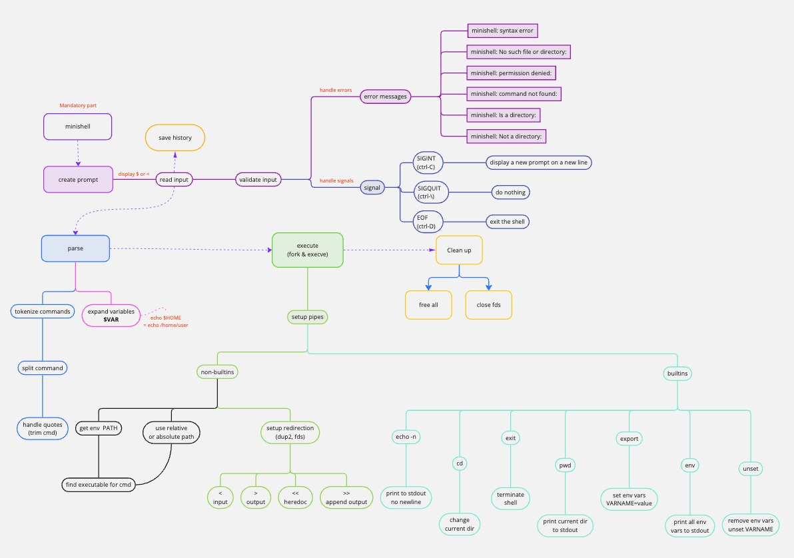

<h1 align="center">
	

</h1>

<p align="center">
	<b><i>As beautiful as a shell</i></b><br>
</p>

<p align="center">
    
<p align="center">
    
    
    
<p align="center">
	
	
	
	
</p>

## 🐚 About The Project

This project is co-written by Allar K. & Lumi K.

The MiniShell project is a hands-on initiative aimed at creating a simple, yet functional shell, similar to a lightweight bash. This project is an excellent opportunity to delve into the intricacies of processes and file descriptors, offering a practical learning experience in system programming and command line interface development.

### Mindmap



## 🏁 Getting Started
### Prerequisites
- `gcc` or `clang`
- `make`

### 🛠️ Installation & Setup

1. Clone the repository: 
```
git clone https://github.com/lkilpela/minishell.git
```

2. Compile the project: `make`

### 🚀 How to Use

After compiling the project, you can start the MiniShell by running the following command in the terminal:

`./minishell`

You'll be greeted by the MiniShell prompt, where you can start typing and executing commands, exploring the functionalities of your custom shell.

## 📝 Evaluation Requirements


### 🧑‍💻 Peer Evaluations (3/3)